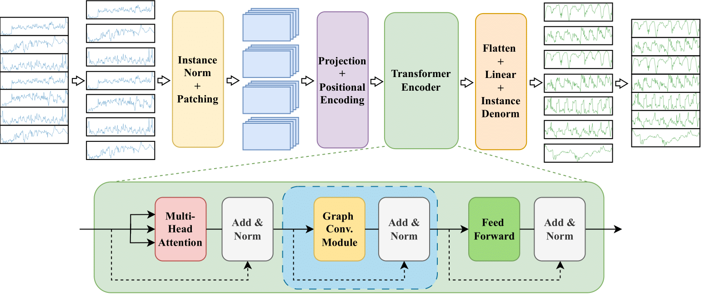
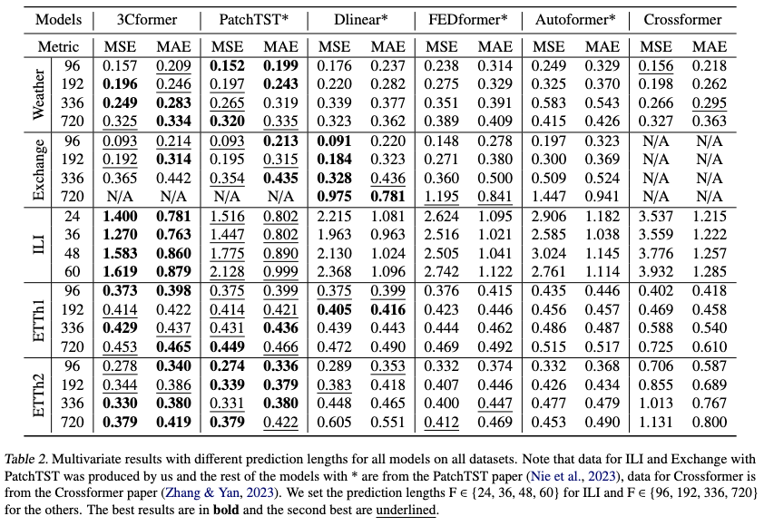

# Crossing the Channels: Improving PatchTST for Long-Term Forecasting

**3Cformer** is designed for **multivariate long-term time series forecasting (MLTSF)**, addressing the limitations of previous transformer models.

### What Previous Approaches Missed

- Channel-independent models ignore relationships between channels.
- Channel-dependent models fail to effectively capture cross-channel interactions.

### How 3Cformer Addresses This

- Builds on **PatchTST**, a strong channel-independent transformer.
- Adds a **Graph Convolutional Network (GCN)**.
- Uses a **cosine similarity-based graph** to explicitly model cross-channel dependencies.
- Evaluated on **5 real-world datasets**.
- Achieves **state-of-the-art performance**, especially when cross-channel correlations are strong.

---

### Datasets

We evaluate 3Cformer on multiple real-world datasets, all available from the **Time-Series-Library**: [https://github.com/thuml/Time-Series-Library](https://github.com/thuml/Time-Series-Library)

To use the data, copy them into source_code/dataset. (We used ETTh1, ETTh2, ILI, Weather, and Exchange datasets)

---

### Model Architecture

The overall architecture of our proposed approach, building upon PatchTST by incorporating a graph convolution module, highlighted by the blue rectangle, within the transformer encoder to capture cross-channel dependencies.

### Results

Our model outperforms PatchTST for MLTSF on datasets that contain many highly correlated features, but has mixed performance, relative to PatchTST, on datasets with less correlated features. This is analysed in detail in our paper.

